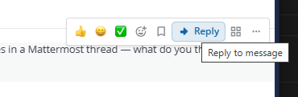
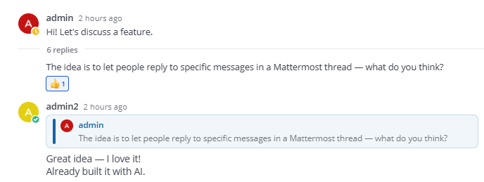

# Mattermost Reply Tools

**Channel Reply** добавляет в Mattermost два явных способа ответить на выбранное сообщение: продолжить разговор прямо в ленте канала с видимой цитатой или отправить обычный ответ внутрь треда.

Это небольшое community-расширение без серверного процесса и страницы настроек. Вся логика интерфейса выполняется в webapp-клиенте Mattermost.

## Как это выглядит

### Выбор сообщения

Кнопка **Reply** появляется в панели действий сообщения и подготавливает основной редактор канала. Тот же ответ можно начать двойным кликом по телу сообщения — в ленте канала или в открытом треде.



### Отправленный ответ

Перед текстом ответа отображается компактная карточка исходного сообщения. Нажатие на неё открывает оригинал по постоянной ссылке.



## Два сценария ответа

| Откуда запускается действие | Куда попадёт ответ | Что увидят участники |
| --- | --- | --- |
| Лента канала → **Reply** | В основной канал, отдельным сообщением | Цитату выбранного сообщения и новый текст |
| Правая панель треда → **Reply** | В текущий тред | Цитату и ответ внутри обсуждения |
| Меню сообщения → **Thread** | В тред выбранного сообщения | Обычное продолжение обсуждения с цитатой |

После выбора сообщения плагин переводит фокус в нужный редактор и показывает предварительный просмотр. Выбор можно отменить крестиком. При отправке плагин сохраняет:

- идентификатор исходного сообщения в свойствах нового поста;
- отдельное тело ответа для собственного web-интерфейса;
- Markdown-цитату в поле сообщения как переносимый запасной формат.

Последний пункт позволяет прочитать результат даже в клиенте, который не умеет отображать компоненты этого плагина.

## Поддержка клиентов

| Клиент | Создание ответа с цитатой | Отображение результата |
| --- | --- | --- |
| Mattermost Web | Полностью поддерживается | Интерактивная карточка цитаты |
| Mattermost Desktop | Полностью поддерживается | Интерактивная карточка цитаты |
| Нативные приложения Android и iOS | Не поддерживается | Обычная Markdown-цитата |

Нативное мобильное приложение не загружает webapp-плагины. Сообщения, созданные через браузер или desktop-клиент, на телефоне остаются читаемыми, но кнопка **Reply** и предварительный просмотр там не появятся.

## Совместимость и ограничения

- минимальная версия Mattermost Server, указанная в манифесте: **9.0.0**;
- текущая версия плагина: **1.2.0**;
- для предсказуемой работы тредов рекомендуется режим **Threaded discussions → Always On**;
- удалённые и системные сообщения не предлагаются в качестве цели ответа;
- длинный исходный текст сокращается в карточке и Markdown-представлении;
- плагин не запускает собственный backend и не добавляет API-методы;
- конфигурационных параметров у плагина нет.

Проект тестировался с Mattermost 10.5.x. Перед установкой в рабочую среду проверьте сборку на той версии сервера и клиента, которую использует ваша команда.

## Установка

Для установки нужен собранный архив:

```text
dist/com.github.mattermost-channel-reply-1.2.0.tar.gz
```

### Через System Console

1. Разрешите использование и загрузку пользовательских плагинов в конфигурации сервера.
2. Откройте **System Console → Plugins → Plugin Management**.
3. Загрузите архив из каталога `dist`.
4. Включите **Channel Reply**.
5. Перезагрузите вкладку Mattermost или desktop-клиент.

### Через mmctl

```bash
mmctl plugin add dist/com.github.mattermost-channel-reply-1.2.0.tar.gz
mmctl plugin enable com.github.mattermost-channel-reply
```

## Сборка из исходников

Понадобятся Node.js 18 или новее, npm, GNU Make, а также `cp`, `mkdir`, `rm` и `tar`.

```bash
make dist
```

Команда устанавливает версии зависимостей из lock-файла, запускает проверку TypeScript, собирает production-бандл и упаковывает готовый плагин.

Отдельные операции:

```bash
make webapp  # зависимости, typecheck и webpack-сборка
make bundle  # упаковка уже собранного webapp/dist
make clean   # удаление сгенерированных файлов и node_modules
```

В Windows Makefile следует запускать через WSL или Git Bash. Проверить webapp без Make можно так:

```bash
cd webapp
npm ci
npm run typecheck
npm run build
```

## Устройство репозитория

| Путь | Назначение |
| --- | --- |
| `plugin.json` | Идентификатор, версия, совместимость и путь к webapp-бандлу |
| `webapp/src/index.tsx` | Регистрация компонентов и перехват отправки сообщений |
| `webapp/src/components/` | Кнопка ответа, карточка цитаты и preview редактора |
| `webapp/src/actions/` | Выбор контекста, открытие треда и переход к оригиналу |
| `webapp/src/utils/mobileQuote.ts` | Формирование Markdown-представления для мобильных клиентов |
| `webapp/src/styles/` | Стили компонентов плагина |
| `Makefile` | Проверка, сборка и создание установочного архива |

## Подготовка собственного релиза

Перед публикацией собственной сборки используйте reverse-DNS идентификатор, которым управляете вы. Текущее значение встречается в нескольких местах и должно меняться согласованно:

- `plugin.json`;
- `webapp/src/manifest.ts`;
- `PLUGIN_STATE_KEY` в `webapp/src/types/store.ts`;
- `PLUGIN_ID` в `Makefile`.

Версию необходимо синхронизировать в `plugin.json`, `webapp/src/manifest.ts`, `webapp/package.json` и `Makefile`. После изменения зависимостей или метаданных npm обновите `webapp/package-lock.json`.

Проект не является официальным продуктом Mattermost и не поддерживается компанией Mattermost.

## Лицензия

MIT — полный текст находится в файле [LICENSE](LICENSE).
